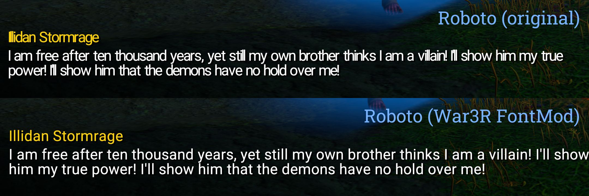

# War3R FontMod

Font modification tool for _Warcraft III: Reforged_.

## Features

* Drag and drop, easy to use.
* Keep letter spacing.

  

## Download

[Latest release](https://github.com/nowar-fonts/War3R-FontMod/releases).

## How-to

1. Choose a replacement font.
   - If you have no idea, the bundled `sample-font.ttf` can be a good start.
   - [Google Fonts](https://fonts.google.com/) and [Font Squirrel](https://www.fontsquirrel.com/) are good places to find free fonts.
   - Variable fonts are not supported. (Choose a “static instance” instead.)
2. Open the `War3R-FontMod` directory; then drag your font and drop it to `run.bat`. A folder `Fonts` will be created in several seconds.
3. Move `Fonts` to _Warcraft III_ installation directory (usually `C:\Program Files (x86)\Warcraft III\`).

## (For advanced users) command line interface

### Compile

With GCC or Clang,
```bash
g++ src/phantom.cpp src/iostream.cpp -Isrc/ -std=c++17 -O2 -o phantom
```

### Run ([otfcc](https://github.com/caryll/otfcc) required)

```bash
otfccdump myfont.ttf -o myfont.otd
./phantom myfont.otd
otfccbuild myfont.otd -O2 -o out.ttf

for font in FRIZQT__ BLQ55Web BLQ85Web THOWR___ NimrodMT
do
  cp out.ttf path/to/war3r/$font.ttf
done
```

## Credits

[otfcc](https://github.com/caryll/otfcc) is used to parse OpenType font files to JSON files and build them back to OpenType font files.

A modified [nlohmann/json](https://github.com/nlohmann/json) library is used to process JSON files.
